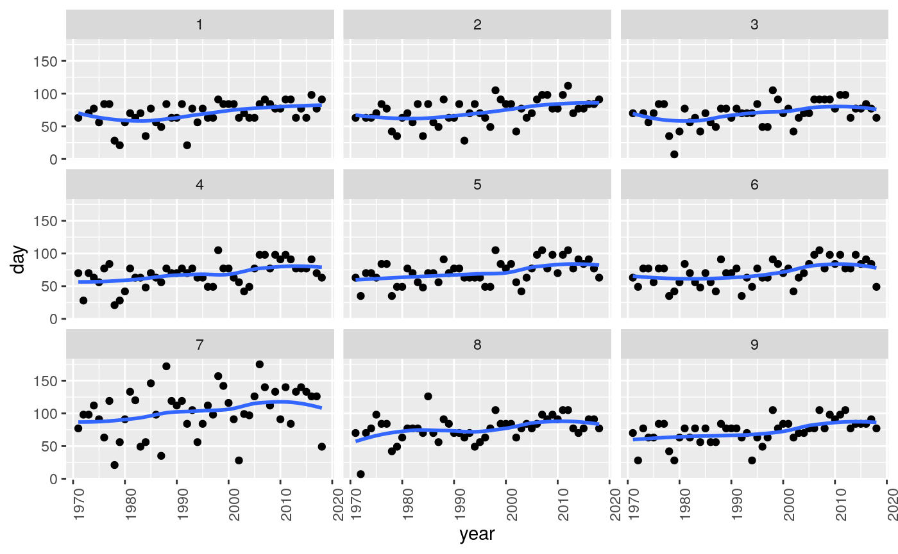

<!-- README.md is generated from README.Rmd. Please edit that file -->

# seaiceR

<!-- badges: start -->

<!-- badges: end -->

The goal of seaiceR is to simplify temporal and spatial analysis of sea
ice data (for example, break-up dates for a number of years at a number
of locations in a study area).

## Installation

You can install the released version of seaiceR from Github with:

``` r
devtools::install_github("nxskok/seaiceR")
```

## Setup

You need two data frames to start (eg. read in from spreadsheets):

  - the data file, with years as rows and columns as locations, and the
    body of the table containing eg. the number of days between the
    start of the year and break-up of ice. The first column should be
    called `year` (lowercase).
  - locations of points within the study area. This needs to be a data
    frame with columns called exactly Location, Longitude and Latitude
    (in some order, with initial uppercase). Longitudes are assumed to
    be west (so positive numbers here will be made negative for the
    maps).

The package includes data frames called `nine_points` and
`nine_points_locations` which are real data from nine points. These data
can be used to try out the package, and will be demonstrated here.

## Example

The basic function that does the whole analysis for a data set is called
`make_everything`. This has defaults, but needs input of the data frames
described above plus a parameter `n_cluster` which is the number of
clusters for the cluster analysis. The last input `n_cluster` must be
specified by name (the function has a lot of optional inputs).

``` r
library(seaiceR)
make_everything(nine_points, nine_points_locations, n_cluster=4)
#> Source : http://tile.stamen.com/toner-lite/5/8/5.png
#> Source : http://tile.stamen.com/toner-lite/5/8/6.png
#> $temporal
#> $temporal[[1]]
#> # A tibble: 9 x 10
#>   location data      z z_star ratio P_value P_value_adj P_value_2
#>      <dbl> <lis> <dbl>  <dbl> <dbl>   <dbl>       <dbl> <chr>    
#> 1        1 <tib…  3.00   3.00 1     2.71e-3   0.00271   0.002711…
#> 2        2 <tib…  3.23   3.23 1     1.25e-3   0.00125   0.001246…
#> 3        3 <tib…  2.77   2.77 1     5.61e-3   0.00561   0.005614…
#> 4        4 <tib…  2.90   2.90 1     3.76e-3   0.00376   0.003761…
#> 5        5 <tib…  2.97   3.95 0.564 2.99e-3   0.0000771 0.002991…
#> 6        6 <tib…  3.26   3.26 1     1.11e-3   0.00111   0.001106…
#> 7        7 <tib…  2.10   1.85 1.28  3.59e-2   0.0641    0.035942…
#> 8        8 <tib…  2.76   2.10 1.74  5.71e-3   0.0361    0.005706…
#> 9        9 <tib…  3.60   3.60 1     3.19e-4   0.000319  0.000318…
#> # … with 2 more variables: P_value_adj_2 <chr>, P_level <fct>
#> 
#> $temporal[[2]]
#> # A tibble: 2 x 2
#>   `P_value_adj <= alpha`     n
#>   <lgl>                  <int>
#> 1 FALSE                      1
#> 2 TRUE                       8
#> 
#> $temporal[[3]]
#> # A tibble: 9 x 3
#>   location data              theil_sen
#>      <dbl> <list>                <dbl>
#> 1        1 <tibble [47 × 2]>     0.5  
#> 2        2 <tibble [47 × 2]>     0.583
#> 3        3 <tibble [47 × 2]>     0.5  
#> 4        4 <tibble [48 × 2]>     0.5  
#> 5        5 <tibble [48 × 2]>     0.56 
#> 6        6 <tibble [48 × 2]>     0.613
#> 7        7 <tibble [48 × 2]>     0.789
#> 8        8 <tibble [48 × 2]>     0.438
#> 9        9 <tibble [48 × 2]>     0.583
#> 
#> $temporal[[4]]
#> # A tibble: 1 x 7
#>    mean    SD   min    Q1 median    Q3   max
#>   <dbl> <dbl> <dbl> <dbl>  <dbl> <dbl> <dbl>
#> 1 0.563 0.101 0.438   0.5   0.56 0.583 0.789
#> 
#> 
#> $spatial
#> $spatial[[1]]
#> Warning in min(x): no non-missing arguments to min; returning Inf
#> Warning in max(x): no non-missing arguments to max; returning -Inf
#> Warning in min(x): no non-missing arguments to min; returning Inf
#> Warning in max(x): no non-missing arguments to max; returning -Inf
```



    #> 
    #> $spatial[[2]]
    #> Warning in min(x): no non-missing arguments to min; returning Inf
    
    #> Warning in min(x): no non-missing arguments to max; returning -Inf
    #> Warning in min(x): no non-missing arguments to min; returning Inf
    #> Warning in max(x): no non-missing arguments to max; returning -Inf


    #> 
    #> $spatial[[3]]
    #> Warning in min(x): no non-missing arguments to min; returning Inf
    
    #> Warning in min(x): no non-missing arguments to max; returning -Inf
    #> Warning in min(x): no non-missing arguments to min; returning Inf
    #> Warning in max(x): no non-missing arguments to max; returning -Inf


    #> 
    #> $spatial[[4]]


    #> 
    #> $spatial[[5]]
    #> Warning in min(x): no non-missing arguments to min; returning Inf
    
    #> Warning in min(x): no non-missing arguments to max; returning -Inf
    #> Warning in min(x): no non-missing arguments to min; returning Inf
    #> Warning in max(x): no non-missing arguments to max; returning -Inf


    #> 
    #> $spatial[[6]]


    #> 
    #> $spatial[[7]]
    #> Warning in min(x): no non-missing arguments to min; returning Inf
    
    #> Warning in min(x): no non-missing arguments to max; returning -Inf
    #> Warning in min(x): no non-missing arguments to min; returning Inf
    #> Warning in max(x): no non-missing arguments to max; returning -Inf


    #> 
    #> $spatial[[8]]


    #> 
    #> $spatial[[9]]
    #> Warning in min(x): no non-missing arguments to min; returning Inf
    
    #> Warning in min(x): no non-missing arguments to max; returning -Inf
    #> Warning in min(x): no non-missing arguments to min; returning Inf
    #> Warning in max(x): no non-missing arguments to max; returning -Inf


Of course, the initial number of clusters will be a complete guess, but
the output includes a scree plot and dendrograms, so `make_everything`
can be run a second time with an improved number of clusters.

There is a lot of output. Specifically, in order:

  - Mann-Kendall temporal trend analysis for each location, including
    adjustment for autocorrelation. The last column summarizes the
    P-value as less than 0.01, between 0.01 and 0.05, between 0.05 and
    0.10, greater than 0.10 (for use in the map later).
  - Summary of how many Mann-Kendall tests have P-value 0.05 or less.
  - Theil-Sen slopes per year, for each location.
  - Mean, standard deviation and five-number summary of the Theil-Sen
    slopes.
  - A map of the locations.
  - A map of the locations with Mann-Kendall significance colour-coded.
  - A map of the locations with the size of the Theil-Sen slope
    indicated by the size of the point.
  - Ward’s cluster analysis with missing values included: a dendrogram
    followed by a map with the locations colour-coded by cluster.
  - A repeat of the above but with missing values removed first: a
    dendrogram followed by a map. I’m not very happy with the
    dendrograms; I like the `rect.hclust` output with rectangles better.
    Here, the clusters are indicated by the colour of the labels at the
    bottom.
  - A scree plot for determining the number of clusters in a K-means
    analysis. This one has an elbow at 4, indicating 4 clusters.
  - A map of the locations with the K-means clusters colour-coded.

## Tweakable things

  - as mentioned before, `n_cluster` can be changed with an improved
    number of clusters (or to compare the output from several numbers of
    clusters).
  - if the area covered by the map is not correct (eg. too small, and
    you want more of the surrounding area), enter values for
    `bounding_box`: in order, the bottom left longitude and latitude,
    and the top right longitude and latitude. Longitudes west (or, I
    guess latitudes south, but I haven’t tested that) should be entered
    as negative numbers. This package uses Stamen maps, which come out
    with exactly the bounding box you ask for (unlike Google maps, which
    always come out square). Enthusiasts of Stamen maps may note that I
    chose “toner-lite” for this package.
  - if the map looks too “fuzzy” and could stand to be sharpened up,
    enter a value for `zoom`. This can be anything between 1 and 18; a
    higher value will be sharper, but entails downloading more map
    tiles. The default is 5.
  - if you want all the points on the Theil-Sen plot to be bigger or
    smaller, enter a value for `scaling`. The default is 1, so a value
    like 2 will make all the points bigger and a value like 0.5 will
    make them all smaller.

Don’t be afraid to run several times until you have output that looks
nice. R can take it. (There is some repetitiveness in the calculation
anyway).
